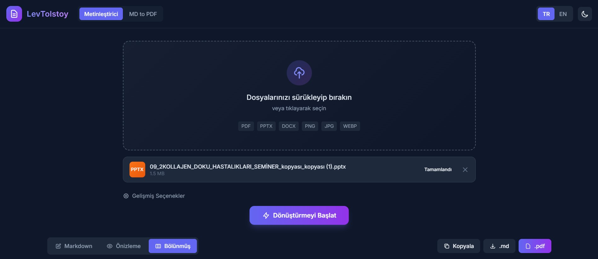
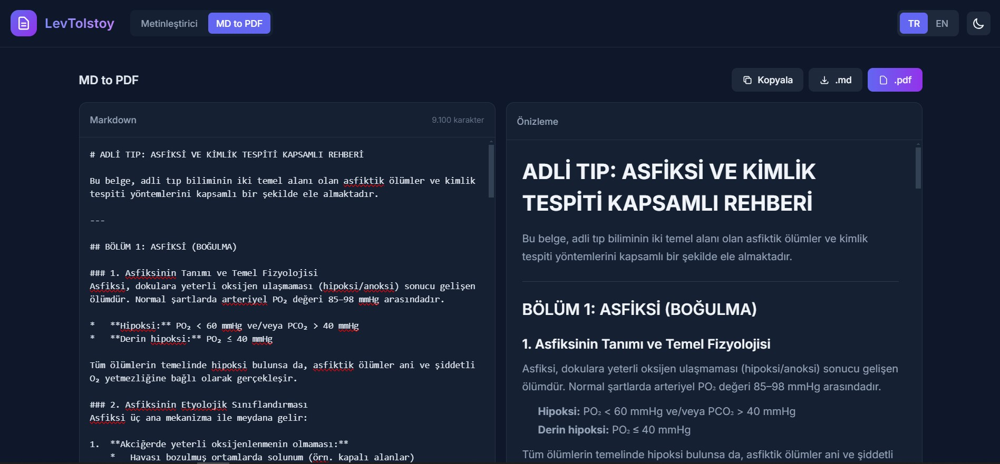

# LevTolstoy


**LevTolstoy** is a powerful document-to-markdown converter powered by **Google Gemini AI**. It allows you to convert PDF, PPTX, DOCX files, and images into clean, editable Markdown format, complete with a built-in split-view editor.

<p align="center">
  
  
</p>

## ✨ Features

-   **AI-Powered Conversion:** Utilizes Google's Gemini 1.5/2.0 Pro/Flash models for high-accuracy text extraction and formatting.
-   **Multi-Format Support:** Convert PDF, PPTX (PowerPoint), DOCX (Word), and Images (PNG, JPG, WEBP).
-   **Rich Markdown Editor:** Built-in editor with syntax highlighting, live preview, and split view.
-   **PDF Export:** Export your edited Markdown directly to PDF with LaTeX (KaTeX) support for math formulas.
-   **Multilingual Interface:** Fully localized in English and Turkish.
-   **Modern UI:** Beautiful, responsive interface with Dark/Light mode support.

## 🚀 Getting Started

### Prerequisites

-   Node.js 18 or higher
-   A Google Gemini API Key
-   (Optional) Google Cloud Console project for Google Drive API (required for PPTX/DOCX conversion)

### 🔑 Google Drive API Setup (Important for PPTX/DOCX)

Since Vercel/Railway are serverless/cloud environments, you cannot perform interactive login (OAuth consent screen) there. You must generate a token locally and add it as an environment variable.

1.  **Create Google Cloud Project:**
    -   Go to [Google Cloud Console](https://console.cloud.google.com/).
    -   Create a new project.
    -   Enable **Google Drive API**.
    -   Go to **Credentials** > **Create Credentials** > **OAuth 2.0 Client ID**.
    -   Select **Desktop App**.
    -   Download the JSON file or copy Client ID and Client Secret.

2.  **Generate Token Locally:**
    -   Run the project locally first.
    -   Add `GOOGLE_CLIENT_ID` and `GOOGLE_CLIENT_SECRET` to your local `.env`.
    -   Run `npm run auth`.
    -   Complete the login in your browser.
    -   This will create a `.google-token.json` file in `server/` folder.

3.  **Prepare for Deployment:**
    -   Open `.google-token.json` and copy its entire content.
    -   Minify the JSON (remove newlines/spaces) to a single line string.
    -   You will use this string as the `GOOGLE_TOKEN` environment variable in Vercel/Railway.

### Installation

1.  Clone the repository:
    ```bash
    git clone https://github.com/GokhanOfficial/LevTolstoy.git
    cd LevTolstoy
    ```

2.  Install dependencies:
    ```bash
    npm install
    # or
    yarn install
    ```

3.  Configure environment variables:
    Copy `.env.example` to `.env` and fill in your API keys.
    ```bash
    cp .env.example .env
    ```
    
    Update `.env`:
    ```env
    GEMINI_API_KEY=your_gemini_api_key
    # Optional: Google Drive config for Office files
    GOOGLE_CLIENT_ID=...
    GOOGLE_CLIENT_SECRET=...
    ```

4.  Start the development server:
    ```bash
    npm run dev
    ```

    Visit `http://localhost:3000` in your browser.

## ☁️ Deployment

### Deploy to Railway

Railway is a great option for deploying Node.js applications with minimal configuration.

1.  Sign up at [Railway.app](https://railway.app/).
2.  Click **"New Project"** and select **"Deploy from GitHub repo"**.
3.  Select `GokhanOfficial/LevTolstoy`.
4.  Add the required environment variables (`GEMINI_API_KEY`, etc.) in the Railway dashboard.
5.  Railway will automatically detect the `package.json` and deploy your app.

### Deploy to Vercel

The project includes a `vercel.json` configuration for easy deployment on Vercel.

1.  Install Vercel CLI: `npm i -g vercel`
2.  Run `vercel` in the project root.
3.  Link your project and deploy.
4.  Remember to set your Environment Variables in the Vercel Project Settings.

Alternatively, connect your GitHub repository to Vercel dashboard and deploy.

## 🛠️ Built With

-   **Backend:** Express.js, Multer
-   **AI:** Google Generative AI SDK (Gemini)
-   **Frontend:** HTML5, TailwindCSS, Vanilla JS
-   **Tools:** Marked.js, Highlight.js, KaTeX, Puppeteer (for PDF generation)

## 📄 License

This project is licensed under the MIT License - see the `LICENSE` file for details.
