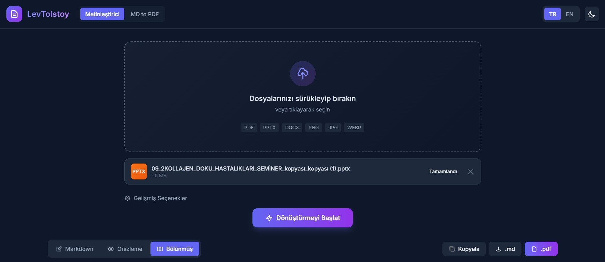
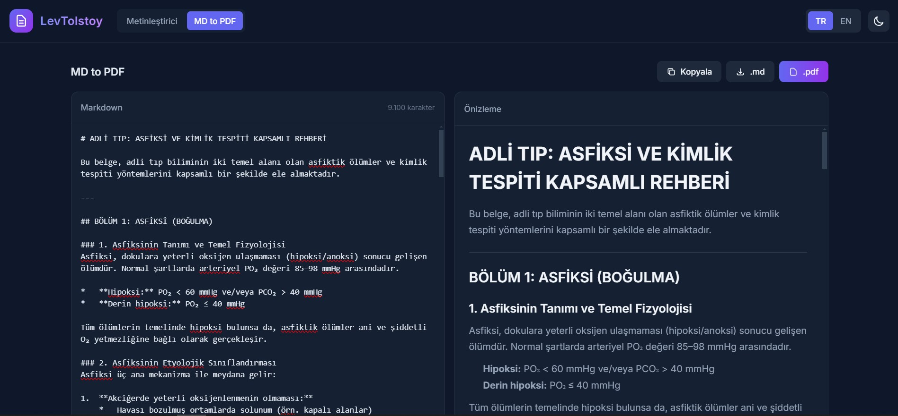

# LevTolstoy 🖋️


**LevTolstoy**, **PDF, PPTX, DOCX, XLSX** dosyalarını ve **Görselleri** temiz, düzenlenebilir **Markdown** formatına dönüştüren gelişmiş bir yapay zeka aracıdır. **OpenAI API** standardını (GPT-4o, Gemini Proxy vb.) destekleyen Geniş Dil Modellerinin (LLM) gücünü kullanır.

Dönüştürme işlemine ek olarak, güçlü bir Markdown editörü, döküman özetleyici ve modern, tema destekli bir arayüz sunar.

<p align="center">
  
  
</p>

## ✨ Özellikler

-   **🤖 Yapay Zeka Destekli Dönüşüm:** En son teknoloji LLM'leri kullanarak karmaşık düzenleri ve metinleri yüksek doğrulukla ayıklar (Varsayılan: `gpt-4o`).
-   **📁 Çoklu Format Desteği:**
    -   **Dökümanlar:** PDF, Metin, Markdown
    -   **Office:** PPTX (PowerPoint), DOCX (Word), XLSX (Excel) _(Google Drive API gerektirir)_
    -   **Görseller:** PNG, JPG, WEBP, GIF
    -   **Ses:** MP3, WAV, OGG
-   **☁️ Bulut Depolama:** Büyük dosya yüklemelerini güvenli şekilde yönetmek için entegre S3 desteği (AWS, MinIO, Cloudflare R2).
-   **📝 Güçlü Markdown Editörü:** Canlı önizleme (Live Preview), bölünmüş görünüm (Split View) ve sözdizimi vurgulama özellikli yerleşik editör.
-   **📑 Özetleyici:** Yapay zeka destekli döküman özetleme aracı.
-   **🎨 Modern Arayüz:** **Karanlık/Aydınlık (Dark/Light)** tema destekli şık arayüz.
-   **🌍 Çoklu Dil Desteği:** Tamamen Türkçe ve İngilizce yerelleştirilmiş arayüz.

## 🚀 Başlarken

### Gereksinimler

-   **Node.js 20** veya üzeri.
-   **OpenAI API Anahtarı** (veya OpenRouter, Gemini Proxy gibi uyumlu bir API).
-   **(Önerilen)** S3 uyumlu nesne depolama (AWS S3, MinIO, R2).
-   **(İsteğe Bağlı)** Office dosya dönüşümü için Google Cloud Projesi.

### Kurulum

1.  **Depoyu klonlayın:**
    ```bash
    git clone https://github.com/GokhanOfficial/LevTolstoy.git
    cd LevTolstoy
    ```

2.  **Bağımlılıkları yükleyin:**
    ```bash
    npm install
    ```

3.  **Yapılandırma:**
    `.env.example` dosyasını `.env` olarak kopyalayın ve anahtarlarınızı girin.
    ```bash
    cp .env.example .env
    ```

    **Önemli Ortam Değişkenleri:**
    ```env
    # AI Sağlayıcı (OpenAI Uyumlu)
    OPENAI_API_KEY=sk-...
    OPENAI_BASE_URL=https://api.openai.com/v1 # veya proxy URL'iniz

    # Depolama (S3) - İsteğe bağlı ama önerilir
    S3_ENDPOINT=https://s3.eu-central-1.amazonaws.com
    S3_REGION=eu-central-1
    S3_BUCKET_NAME=my-bucket
    S3_ACCESS_KEY_ID=...
    S3_SECRET_ACCESS_KEY=...
    ```

4.  **Google Drive Kurulumu (Office Dosyaları İçin):**
    _Sadece .pptx, .docx, .xlsx dosyalarını dönüştürmek istiyorsanız gereklidir._
    
    1.  [Google Cloud Console](https://console.cloud.google.com/) üzerinde bir proje oluşturun.
    2.  **Google Drive API**'yı etkinleştirin.
    3.  OAuth 2.0 Bilgileri (Desktop App) oluşturun ve Client ID/Secret değerlerini indirin.
    4.  Bunları `.env` dosyasına ekleyin:
        ```env
        GOOGLE_CLIENT_ID=...
        GOOGLE_CLIENT_SECRET=...
        ```
    5.  Token oluşturmak için yetkilendirme betiğini çalıştırın:
        ```bash
        npm run auth
        ```
        _Bu işlem `server/` klasöründe `.google-token.json` dosyası oluşturur. Canlı ortam (Production) için bu dosyanın içeriğini `GOOGLE_TOKEN` ortam değişkenine kopyalayabilirsiniz._

5.  **Sunucuyu başlatın:**
    ```bash
    npm run dev
    ```
    Tarayıcınızda `http://localhost:3000` adresine gidin.

## 📦 Dağıtım (Deployment)

### Docker Compose

Proje, mevcut `.env` yapısıyla uyumlu `Dockerfile` ve `docker-compose.yml` dosyalarıyla çalışır.

1.  `.env.example` dosyasını `.env` olarak kopyalayın ve değerleri doldurun:
    ```bash
    cp .env.example .env
    ```

2.  İmajı oluşturup uygulamayı başlatın:
    ```bash
    docker compose up --build -d
    ```

3.  Durumu kontrol edin:
    ```bash
    docker compose ps
    ```

4.  Logları izleyin:
    ```bash
    docker compose logs -f levtolstoy
    ```

5.  Uygulamayı durdurun:
    ```bash
    docker compose down
    ```

Varsayılan adres: `http://localhost:3000`. `PORT` değerini `.env` içinde değiştirirseniz Compose port eşleştirmesi de aynı değeri kullanır.

**Notlar:**
-   `docker-compose.yml`, `.env` dosyasını `env_file` ile doğrudan container'a aktarır.
-   S3 yapılandırılmamışsa geçici dosyalar `levtolstoy-cache` volume'u üzerinde tutulur.
-   Markdown → PDF özellikleri için runtime imajına Chromium ve gerekli fontlar eklenmiştir.
-   Google Drive OAuth için canlı ortamda `GOOGLE_TOKEN` env değişkenini kullanmanız önerilir. Dosya tabanlı token gerekiyorsa `docker-compose.yml` içindeki `./server/.google-token.json` volume satırını açabilirsiniz.

### Docker CLI

Compose kullanmadan manuel çalıştırmak için:

```bash
docker build -t levtolstoy:latest .
docker run --rm -p 3000:3000 --env-file .env -v levtolstoy-cache:/app/public/cache levtolstoy:latest
```

### Dokploy / Nixpacks

Bu proje **Docker** veya **Nixpacks** (Dokploy, Railway vb. tarafından kullanılır) ile dağıtım için optimize edilmiştir.

**Gereksinimler:**
-   Build ortamınızın **Node.js 20** kullandığından emin olun.
-   Proje, Dokploy üzerinde sorunsuz dağıtım için `nixpacks.toml` yapılandırmasını içerir.

**Canlı Ortamda Kalıcı Google Token'ı:**
Google Refresh Token, "Testing" statüsündeki projeler için 7 gün sonra geçersiz olur. Bunu engellemek için:
1.  Google Cloud Console > **OAuth consent screen** menüsüne gidin.
2.  Statüsü **"PUBLISH APP"** (Production) olarak ayarlayın.
3.  Token'ı yerelde tekrar oluşturun (`npm run auth`).
4.  `.google-token.json` dosyasının JSON içeriğini kopyalayın ve dağıtım platformunuzda `GOOGLE_TOKEN` ortam değişkeni olarak ayarlayın.

## 🛠️ Teknolojiler

-   **Backend:** Node.js, Express, AWS SDK v3
-   **Frontend:** HTML5, TailwindCSS (Vanilla JS)
-   **AI Entegrasyon:** OpenAI SDK
-   **Depolama:** S3 (AWS SDK)
-   **Araçlar:** Marked.js, Highlight.js, KaTeX

## 📄 Lisans

Bu proje MIT Lisansı ile lisanslanmıştır - detaylar için `LICENSE` dosyasına bakınız.
