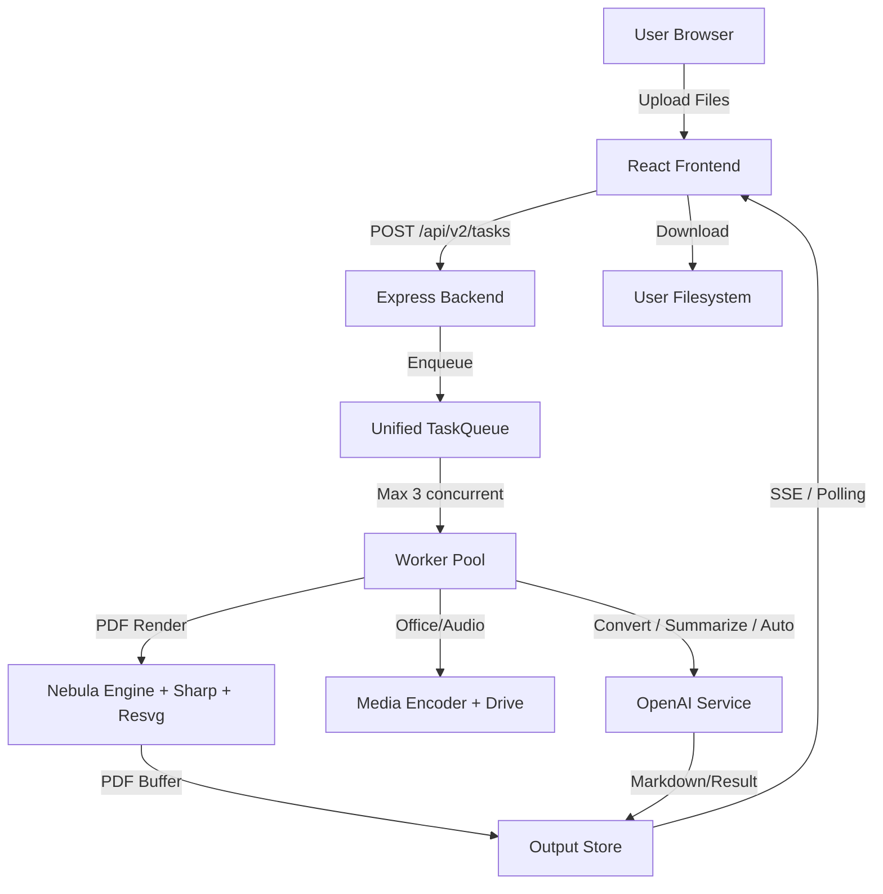
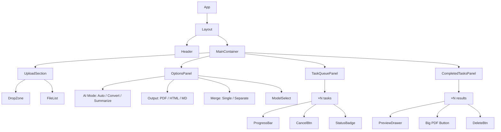
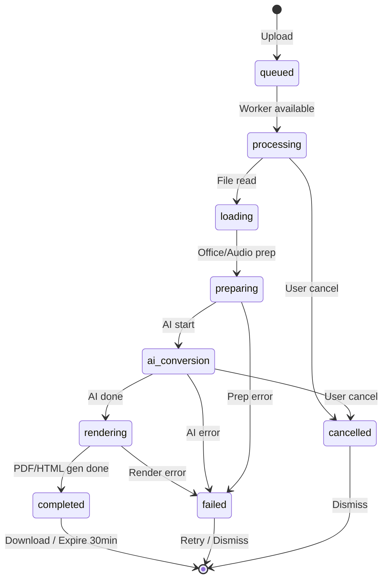
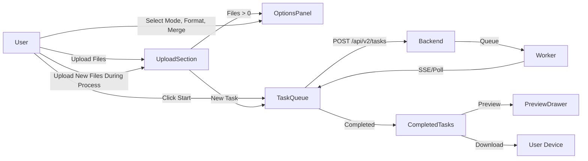

# LevTolstoy Full Refactor Planı (Nebula PDF Engine + React + Backend Rewrite)

> **Hedef:** Mevcut karışık Vanilla JS arayüzünü React + Vite + TypeScript ile yeniden yazmak; `md-to-pdf` (Puppeteer/Chromium) bağımlılığını kaldırıp **Nebula PDF Engine** ile headless-browser-free, modern JSX/Flexbox PDF üretimine geçmek; Converter + Summarizer'ı tek sayfada birleştirmek; AI'ın kullanıcı yerine "metne sadık kal vs. özetle" kararını verebilmesini sağlamak; **3 concurrent işlem limitli unified task queue** kurmak; **backend route'larını ve servislerini ihtiyaç doğrultusunda en baştan dizayn etmek**.

---

## 1. Mevcut Durum Analizi (SWOT)

### Güçlü Yönler (Korunacak)
- **Renk paleti & tema:** Slate + Indigo/Purple gradient sistemi beğeniliyor.
- **Task polling mimarisi:** `tasks` Map + `/status/:taskId` polling çalışıyor.
- **Backend servis katmanı:** `fileHandler`, `openai`, `mediaEncoder` iyi ayrılmış.
- **Çoklu dosya & format desteği:** PDF, DOCX, PPTX, XLSX, medya, resim vs.

### Zayıf Yönler (Tamamen Değiştirilecek)
- **Frontend:** Vanilla JS, DOM manipulation yoğun, dil değişiminde state senkronizasyonu hatalı.
- **PDF Engine:** `md-to-pdf` → Puppeteer → Chromium indirme/deploy zorluğu (özellikle Docker/Vercel).
- **UX:** Anasayfada gereksiz Markdown editor; kullanıcı direkt indirmek istiyor.
- **Navigasyon:** Converter, Summarizer, MD-to-PDF ayrı sayfalar; kullanıcı akışı kırılıyor.
- **Queue:** Summarizer ve Converter task'ları ayrı store'lar; merkezi bir queue yok.
- **Backend Routes:** Eski `/api/convert`, `/api/summarize`, `/api/pdf` ayrı route'lar. Birleşik task modeli yok.

---

## 2. Yeni Teknoloji Stack'i

| Katman | Mevcut | Yeni | Gerekçe |
|--------|--------|------|---------|
| Frontend | Vanilla JS + Tailwind CDN | React 19 + Vite + TypeScript + Tailwind CSS v4 + shadcn/ui | Maintainability, type safety, modern UX patterns |
| State | Global `window.App` object | Zustand | Minimal, hooks-friendly, no boilerplate |
| i18n | Custom `data-i18n` DOM scan | react-i18next | Robust, interpolation, pluralization, lazy loading |
| Routing | Custom hash router | React Router v7 | SPA, code splitting, nested layouts |
| Icons | Inline SVGs | Lucide React | Consistent, tree-shakeable, accessible |
| Notifications | Custom DOM toast | Sonner (shadcn) | Native feels, promise handling |
| **PDF Engine** | `md-to-pdf` (Puppeteer) | **`nebula-pdf-engine`** + `sharp` + `@resvg/resvg-js` | **JSX/Flexbox DX, headless-browser-free, Rust rendering, multi-page, table desteği** |
| Markdown Parser | `marked` CDN | `marked` npm (server+client) | AST erişimi (lexer) için npm paketi gerekli |
| Task Queue | In-memory Map × 2 | Unified `TaskQueue` class (`p-queue` + custom wrapper) | Max 3 concurrency, global queue visibility |
| Backend Framework | Express (mevcut route'lar) | **Express + Route re-design** | `server/v2/` klasöründe yeni API; eski API'ler parallel çalışır |

### PDF Engine: Nebula PDF Engine Detayları

**Nebula**, Satori + Resvg (Rust) + pdf-lib ile çalışır. Headless browser gerektirmez. JSX ve Flexbox layout sunar. **Preact** JSX runtime kullanır.

**Kurulum:**
```bash
npm install nebula-pdf-engine sharp @resvg/resvg-js
```

**Sharp Native Dependency Notu:** `sharp` ve `@resvg/resvg-js` native binary içerir. Docker kullanıyorsak:
- **Alpine Linux:** `apk add --no-cache build-base python3` gerekir ve `npm install --build-from-source` önerilir (musl libc uyumluluğu).
- **Debian/Ubuntu (node:20-slim):** `apt-get install -y build-essential python3` yeterli. Image Alpine'dan biraz daha büyük ama native dependency uyumluluğu daha yüksek.
- **Tavsiye:** Docker base image `node:20-slim` (Debian) olarak güncellensin. Alpine'da sharp binary sorunları yaşanabilir.

**Font (Türkçe Karakter):**
- Nebula'ya font `data` olarak `Buffer` verilir. **Inter** font family (Google Fonts'tan indirilebilir TTF/OTF) kullanılacak.
- `Inter-Regular.ttf` (400) ve `Inter-Bold.ttf` (700) gerekli.
- Font dosyaları `server/assets/fonts/` altında tutulur, engine init'te `fs.readFileSync` ile yüklenir.

**Markdown → Nebula JSX Transformer:**
- `marked` lexer'ı ile markdown AST alınır.
- Her token tipi için recursive renderer yazılır:
  - `heading` → `<Text style={{ fontSize: ..., fontWeight: 'bold', marginBottom: ... }}>`
  - `paragraph` → `<Text>` (inline token'lar: `strong`, `em`, `code`, `link`, `image`)
  - `code` (block) → `<Box>` + `<Text style={{ fontFamily: 'monospace' }}>` (preformatted)
  - `blockquote` → `<Box style={{ borderLeft: ..., paddingLeft: ..., backgroundColor: ... }}>`
  - `list` / `list_item` → `<Box>` + `<Text>` (bullet/number prefix)
  - `table` → Nebula `<Table>` component'i (en büyük avantaj)
  - `hr` → `<Box style={{ borderTop: ..., height: 1 }}>`
  - `image` → `<Image src={url} width={...} height={...} />` (width/height required; async fetch + sharp ile ölçülebilir veya default 300x200 atanır)
- **Image boyutları:** Markdown'ta `` için width/height bilinmez. Opsiyonlar:
  1. Async fetch + `sharp` metadata ile boyut ölç, scale down yap (max 500px width). Maliyetli ama doğru.
  2. Default `width: 300, height: 200` ata (aspect ratio bozulabilir).
  3. Markdown AST'ye `width`/`height` ekleme desteği (ileri seviye).
  - **Karar:** Faz 1'de `sharp` ile `fetch → metadata` yap, timeout 5sn. Faz 2'de markdown'a resim boyut annotation desteği eklenebilir.

**Nebula Engine Init (Server-side):**
```typescript
import { PdfEngine } from 'nebula-pdf-engine';
import * as fs from 'fs';
import * as path from 'path';

const engine = new PdfEngine({
  fonts: [
    { name: 'Inter', data: fs.readFileSync(path.join(__dirname, '../assets/fonts/Inter-Regular.ttf')), weight: 400 },
    { name: 'Inter', data: fs.readFileSync(path.join(__dirname, '../assets/fonts/Inter-Bold.ttf')), weight: 700 },
  ],
  devicePixelRatio: 2, // Retina quality
});
```

**Markdown Render Example:**
```tsx
import { Page, Text, Box, Table, Image } from 'nebula-pdf-engine';

// Transformer output
const pdfJsx = (
  <Page size="A4" padding={40}>
    <Text style={{ fontSize: 28, fontWeight: 700, marginBottom: 20, color: '#1e293b' }}>
      {title}
    </Text>
    <Text style={{ fontSize: 12, lineHeight: 1.6, color: '#334155' }}>
      {bodyText}
    </Text>
    {/* ... tokens mapped recursively ... */}
  </Page>
);

const pdfBuffer = await engine.generate(pdfJsx);
```

---

## 3. Mimari Diyagramlar

### 3.1 Genel Sistem Akışı


### 3.2 Frontend Component Hierarchy (Tek Sayfa)


### 3.3 Backend Task State Machine


---

## 4. Backend Redesign (v2 — Sıfırdan)

Mevcut `server/routes/convert.js`, `server/routes/summarize.js`, `server/routes/pdf.js` gibi ayrı route'lar kaldırılıp yerine **tek bir task-centric API** gelir. Eski API'ler (`/api/convert`, `/api/summarize`, `/api/pdf`) parallel çalışmaya devam eder (backward compatibility) ama yeni frontend sadece `/api/v2/*` kullanır.

### 4.1 Yeni Klasör Yapısı
```
server/
  v2/
    routes/
      tasks.js          # POST /api/v2/tasks, GET /api/v2/tasks/:id, POST /api/v2/tasks/:id/cancel
      queue.js          # GET /api/v2/queue/status
      download.js       # GET /api/v2/tasks/:id/download?format=pdf|html|md
    services/
      taskQueue.js      # Unified TaskQueue class (p-queue + EventEmitter)
      taskProcessor.js  # Task logic (convert, summarize, auto, render)
      nebulaEngine.js   # Nebula PDF Engine wrapper + font init
      markdownRenderer.js # Marked AST → Nebula JSX transformer
      htmlRenderer.js   # Markdown → Styled HTML (for HTML output)
    utils/
      autoModePrompt.js # AI Auto mode prompt
```

### 4.2 Unified Task Model
```typescript
interface Task {
  id: string;
  type: 'convert' | 'summarize' | 'auto';
  status: 'queued' | 'processing' | 'completed' | 'failed' | 'cancelled';
  phase: 'queued' | 'loading' | 'preparing' | 'media-encoding' | 'ai-conversion' | 'rendering' | 'completed' | 'failed' | 'cancelled';
  message: string;
  progress: number; // 0-100

  // Input
  files: Array<{
    filename: string;
    mimetype: string;
    size: number;
    buffer: Buffer; // stored in memory (current limit ~25MB) or s3 key
  }>;
  model: string;
  outputFormat: 'pdf' | 'html' | 'markdown';
  mergeMode: 'single' | 'separate';
  aiDecision?: 'convert' | 'summarize'; // Auto mode kararı

  // Output
  markdown?: string; // For preview / MD download
  pdfBuffer?: Buffer;
  htmlContent?: string;
  filename?: string;

  // Meta
  createdAt: number;
  startedAt: number | null;
  completedAt: number | null;
  error: string | null;
  abortController: AbortController;
  // Internal
  fileInputs?: any[]; // fileHandler processed inputs
}
```

### 4.3 API Endpoints (v2)

| Endpoint | Method | Body / Params | Açıklama |
|----------|--------|-------------|----------|
| `/api/v2/tasks` | POST | `{ files: File[], type: 'auto' \| 'convert' \| 'summarize', model: string, outputFormat: 'pdf' \| 'html' \| 'markdown', mergeMode: 'single' \| 'separate' }` | Yeni task oluştur. Auto mode ise AI karar aşaması da bu task'ın processing'ine girer. |
| `/api/v2/tasks` | GET | — | Tüm task listesi (queue + running + completed). Kullanıcı session'a göre filtrele (opsiyonel). |
| `/api/v2/tasks/:id` | GET | — | Tek task detayı (status, progress, phase, markdown preview). |
| `/api/v2/tasks/:id/cancel` | POST | — | Task iptal. AbortController signal, ffmpeg process kill. |
| `/api/v2/tasks/:id/download` | GET | `?format=pdf\|html\|md` | Task sonucu indir. Format task outputFormat'ına da eşleşmeli. Content-Disposition attachment. |
| `/api/v2/queue/status` | GET | — | Aktif worker sayısı, queue'daki task sayısı, max concurrency (3). |
| `/api/v2/health` | GET | — | Health check. |
| `/api/v2/stream` | GET | — | **SSE** (opsiyonel). Task state change'leri stream eder. Frontend polling yerine SSE kullanabilir. |

### 4.4 TaskQueue Manager (`server/v2/services/taskQueue.js`)

```typescript
import PQueue from 'p-queue';
import EventEmitter from 'events';

class TaskQueue extends EventEmitter {
  private queue: PQueue;
  private tasks: Map<string, Task>;
  private maxConcurrency: number = 3;

  constructor() {
    super();
    this.queue = new PQueue({ concurrency: this.maxConcurrency });
    this.tasks = new Map();
  }

  add(task: Task): void {
    this.tasks.set(task.id, task);
    this.emit('taskAdded', task);

    this.queue.add(async () => {
      await this.process(task);
    });
  }

  async process(task: Task): Promise<void> {
    // ... taskProcessor çağır
    // State değişimlerinde this.emit('taskUpdated', task)
  }

  cancel(taskId: string): void {
    const task = this.tasks.get(taskId);
    if (!task) return;
    task.abortController.abort();
    task.status = 'cancelled';
    this.emit('taskUpdated', task);
  }

  getStatus(): { active: number; queued: number; max: number } {
    return {
      active: this.queue.pending, // p-queue naming: pending = running
      queued: this.queue.size,    // size = waiting
      max: this.maxConcurrency,
    };
  }

  getAll(): Task[] {
    return Array.from(this.tasks.values());
  }
}
```

**SSE Integration:**
```typescript
// server/v2/routes/stream.js
app.get('/api/v2/stream', (req, res) => {
  res.setHeader('Content-Type', 'text/event-stream');
  res.setHeader('Cache-Control', 'no-cache');
  res.setHeader('Connection', 'keep-alive');

  const onUpdate = (task: Task) => {
    res.write(`data: ${JSON.stringify(sanitizeTask(task))}\n\n`);
  };

  taskQueue.on('taskUpdated', onUpdate);
  req.on('close', () => taskQueue.off('taskUpdated', onUpdate));
});
```

### 4.5 Task Processor (`server/v2/services/taskProcessor.js`)

Her task'in processing pipeline'ı:

```typescript
async function processTask(task: Task, queue: TaskQueue): Promise<void> {
  try {
    task.status = 'processing';
    task.startedAt = Date.now();
    queue.emit('taskUpdated', task);

    // 1. Loading (files read to buffer if not already)
    // ...

    // 2. Auto Mode Decision (if type === 'auto')
    if (task.type === 'auto') {
      task.phase = 'ai-conversion'; // Actually decision phase
      task.message = 'AI mod kararı veriyor...';
      queue.emit('taskUpdated', task);

      const decision = await decideAutoMode(task);
      task.aiDecision = decision; // 'convert' | 'summarize'
      task.type = decision; // Override internal type
    }

    // 3. Prepare files (office conversion, media encoding)
    // Uses existing fileHandler.prepareFile logic

    // 4. AI Processing (convert or summarize)
    // Uses openai service with streaming chunk callback

    // 5. Filename generation (AI-based)

    // 6. Render Output
    if (task.outputFormat === 'pdf') {
      task.phase = 'rendering';
      task.message = 'PDF oluşturuluyor...';
      queue.emit('taskUpdated', task);
      task.pdfBuffer = await nebulaEngine.renderPdf(task.markdown!, task.filename);
    } else if (task.outputFormat === 'html') {
      task.htmlContent = htmlRenderer.render(task.markdown!);
    }
    // markdown output already in task.markdown

    task.status = 'completed';
    task.phase = 'completed';
    task.progress = 100;
    task.message = 'Tamamlandı';
    task.completedAt = Date.now();
  } catch (error) {
    // ... error handling, wasCancelled check
  } finally {
    queue.emit('taskUpdated', task);
    // Cleanup after 30 min
    setTimeout(() => queue.tasks.delete(task.id), 30 * 60 * 1000);
  }
}
```

### 4.6 Auto Mode Logic

AI'a gönderilen prompt (Türkçe/İngilizce task language'e göre):

```text
You are a document classifier. I will give you the first ~3000 characters of a document.

Decide whether this document should be:
- "convert": Fully converted to Markdown (faithful to the original text, preserving structure, headings, lists, tables, code). Use this for PDFs, DOCX, PPTX, text-heavy documents, reports, academic papers, scripts, transcripts.
- "summarize": Summarized into a shorter Markdown (key points, bullet points, condensed version). Use this for very long articles, books, news, meeting notes, or documents where the user likely wants the gist rather than every detail.

Respond with ONLY one word: "convert" or "summarize". No explanation.

Document excerpt:
---
{first_3000_chars}
---
```

**Edge Case:** Eğer AI kararsız kalırsa (boş veya tanınmayan kelime dönerse) default `convert`.

### 4.7 Merge Mode Logic

- **`single`:** Tüm dosyalar tek task'ta. `fileHandler.processMultipleFiles` çağrılır. Tek bir markdown çıktısı alınır. Output (PDF/HTML/MD) tek dosya.
- **`separate`:** Her dosya için `processTask` ayrı çağrılır. Ama frontend'de tek upload yapıldığında backend bu dosyaları iterate edip her biri için task oluşturabilir. **Karar:** Frontend `mergeMode: 'separate'` gönderdiğinde, backend `files.length` kadar task queue'ya ekler. Her task ayrı id. Frontend'de N adet task kartı görünür. Queue 3 concurrent limit olduğundan kalanı sıraya girer.

---

## 5. Markdown → Nebula JSX Transformer

### 5.1 Transformer Design (`server/v2/services/markdownRenderer.js`)

```typescript
import { marked } from 'marked';
import { Page, Text, Box, Image, Table } from 'nebula-pdf-engine';
import { h } from 'preact'; // Nebula uses Preact JSX runtime
import sharp from 'sharp';

// Custom styles map to Nebula compatible styles
const styles = {
  h1: { fontSize: 28, fontWeight: 700, color: '#1e293b', marginBottom: 16, marginTop: 24 },
  h2: { fontSize: 22, fontWeight: 700, color: '#334155', marginBottom: 12, marginTop: 20 },
  h3: { fontSize: 18, fontWeight: 600, color: '#475569', marginBottom: 10, marginTop: 16 },
  body: { fontSize: 12, lineHeight: 1.6, color: '#334155' },
  codeInline: { fontFamily: 'monospace', fontSize: 11, backgroundColor: '#f1f5f9', color: '#e83e8c', padding: 2 },
  codeBlock: { fontFamily: 'monospace', fontSize: 10, backgroundColor: '#1e293b', color: '#e2e8f0', padding: 12, borderRadius: 6, marginVertical: 12 },
  blockquote: { borderLeft: 4, borderLeftColor: '#6366f1', paddingLeft: 12, backgroundColor: '#eff6ff', padding: 12, marginVertical: 12, borderRadius: 4 },
  tableHeader: { backgroundColor: '#6366f1', color: '#ffffff', fontWeight: 600 },
  tableCell: { borderBottom: 1, borderBottomColor: '#e2e8f0', padding: 8 },
  link: { color: '#6366f1', textDecoration: 'underline' },
};

async function renderTokens(tokens: Token[], engine: PdfEngine, baseUrl?: string): Promise<any[]> {
  const elements: any[] = [];
  for (const token of tokens) {
    switch (token.type) {
      case 'heading': {
        const styleKey = `h${token.depth}` as keyof typeof styles;
        elements.push(
          <Text style={styles[styleKey] || styles.h3}>
            {token.text}
          </Text>
        );
        break;
      }
      case 'paragraph': {
        const inline = await renderInline(token.tokens, baseUrl);
        elements.push(<Text style={styles.body}>{inline}</Text>);
        break;
      }
      case 'code': {
        elements.push(
          <Box style={styles.codeBlock}>
            <Text style={{ fontFamily: 'monospace', fontSize: 10, color: '#e2e8f0' }}>
              {token.text}
            </Text>
          </Box>
        );
        break;
      }
      case 'blockquote': {
        const inner = await renderTokens(token.tokens, engine, baseUrl);
        elements.push(
          <Box style={styles.blockquote}>
            {inner}
          </Box>
        );
        break;
      }
      case 'list': {
        const items = await Promise.all(token.items.map(async (item) => {
          const inner = await renderTokens(item.tokens, engine, baseUrl);
          const prefix = token.ordered ? `${item.index}. ` : '• ';
          return (
            <Box style={{ flexDirection: 'row', marginBottom: 4 }}>
              <Text style={{ ...styles.body, width: 20 }}>{prefix}</Text>
              <Box style={{ flex: 1 }}>{inner}</Box>
            </Box>
          );
        }));
        elements.push(<Box style={{ marginVertical: 8 }}>{items}</Box>);
        break;
      }
      case 'table': {
        const columns = token.header.map((cell, i) => ({
          header: cell.text,
          key: `col${i}`,
          flex: 1,
        }));
        const data = token.rows.map((row) => {
          const obj: any = {};
          row.forEach((cell, i) => { obj[`col${i}`] = cell.text; });
          return obj;
        });
        elements.push(
          <Table
            columns={columns}
            data={data}
            options={{ headerRepeat: true, stripe: true }}
            headerStyle={styles.tableHeader}
            rowStyle={styles.tableCell}
          />
        );
        break;
      }
      case 'hr': {
        elements.push(<Box style={{ borderTop: 1, borderTopColor: '#e2e8f0', height: 1, marginVertical: 16 }} />);
        break;
      }
      case 'space': {
        // ignore or add spacer
        break;
      }
      default: {
        // Fallback: render text
        if (token.text) {
          elements.push(<Text style={styles.body}>{token.text}</Text>);
        }
      }
    }
  }
  return elements;
}

async function renderInline(tokens: any[], baseUrl?: string): Promise<any[]> {
  // strong, em, codespan, link, image, text
  return tokens.map(t => {
    switch (t.type) {
      case 'text': return t.text;
      case 'strong': return <Text style={{ fontWeight: 700 }}>{t.text}</Text>;
      case 'em': return <Text style={{ fontStyle: 'italic' }}>{t.text}</Text>;
      case 'codespan': return <Text style={styles.codeInline}>{t.text}</Text>;
      case 'link': return <Text style={styles.link}>{t.text}</Text>;
      case 'image': {
        // Image src handling: baseUrl + relative path resolve
        // Width/height default
        return <Image src={t.href} width={300} height={200} />; // Faz 1 default
      }
      default: return t.text;
    }
  });
}

export async function renderMarkdownToNebula(markdown: string, engine: PdfEngine, title?: string): Promise<any> {
  const lexer = new marked.Lexer();
  const tokens = lexer.lex(markdown);
  const bodyElements = await renderTokens(tokens, engine);

  return (
    <Page size="A4" padding={40}>
      {title && (
        <Text style={{ fontSize: 32, fontWeight: 700, color: '#1e293b', marginBottom: 24 }}>
          {title}
        </Text>
      )}
      {bodyElements}
    </Page>
  );
}
```

**Not:** `marked` lexer'ı heading depth 4,5,6 da döner. `styles.h4` eklenmeli. `image` token'ında `href` relative olabilir. `baseUrl` (eğer dosya upload'tan geliyorsa null) verilebilir. Inline rendering'de `Text` component'inin child olarak `Text` alması Nebula'da desteklenmeyebilir. `renderInline` yerine string interpolation veya `<span>` benzeri Text birleştirme yapılmalı. Bu transformer implementasyonunda detaylı test gerekli.

---

## 6. Frontend Design (Tek Sayfa)

### 6.1 Sayfa Bölümleri (Sections)
1. **Header (Yapışkan):**
   - Logo + "LevTolstoy"
   - Nav: Tek sayfa olduğundan scroll-to-section veya collapsed menu. "Tüm Görevler" / "Yeni İşlem".
   - Dil switcher (TR/EN) + Tema switcher (Dark/Light/System)
2. **Hero / Upload:**
   - Büyük, merkezi drop zone. Sürükle-bırak + click.
   - Yüklenen dosyaların listesi (isim, boyut, silme ikonu).
   - "Dosya Ekle" butonu (multiple).
3. **Options Panel (Dosya yüklendikten sonra görünür):**
   - **AI Mode:** 3 radio card/toggle. `Auto` (ön planlı), `Tam Dönüştürme`, `Özetle`.
   - **Çıktı Formatı:** `PDF` (büyük, primary), `HTML`, `Markdown`. PDF vurgulu.
   - **Birleştirme:** Toggle/Segmented control. `Tek Dosyada Birleştir` / `Her Dosya Ayrı`.
   - **Model:** Select dropdown (gemini modelleri).
   - **Başlat Butonu:** Büyük, full-width, primary gradient. "AI ile İşlemi Başlat".
4. **Active Task Queue (Canlı):**
   - Her task bir kart (card).
   - Kart içinde: Dosya adı/ları, AI mode badge, progress bar (animated), ETA, durum badge (İşleniyor, Sırada, Tamamlandı), İptal butonu.
   - İşlem devam ederken bu section altında yeni upload yapılabilir (yeni task oluşturulur, queue'ya eklenir).
5. **Completed Tasks (Arşiv):**
   - Tamamlanan task'lar grid/card listesi.
   - Her kartta: Önizleme (ilk 3 satır markdown veya PDF ikonu), Dosya adı, Tarih, Format badge.
   - **Büyük PDF İndirme Butonu:** Primary, büyük, dikkat çekici. (PDF seçilmişse). HTML/MD için secondary butonlar.
   - "Önizle" (Drawer/Modal açar), "Sil" (Kaldırır), "Kopyala" (MD içeriğini).
6. **Preview Drawer/Modal:**
   - Markdown'ın HTML render'ını gösterir (read-only, client-side `marked` + DOMPurify).
   - PDF seçilmişse: PDF iframe preview (data URL / blob).
   - HTML seçilmişse: Styled iframe preview.

### 6.2 Interaction Flow


### 6.3 Responsive Davranış
- **Desktop:** 2-3 kolonlu grid (task'lar ve tamamlananlar yan yana). Upload area geniş.
- **Tablet:** 2 kolonlu grid.
- **Mobile:** Tek kolon. Upload alanı tam genişlik. Task kartları üst üste. Preview drawer bottom sheet olarak.

### 6.4 Renk & Tema (Korunacak Mevcut)
- **Dark (Default):** `bg-slate-900`, `text-slate-100`, card `bg-slate-800/50`, border `slate-700/50`.
- **Primary Gradient:** `from-indigo-500 to-purple-600` (CTA butonları, progress bar, active states).
- **Success:** Emerald, **Error:** Red, **Warning:** Amber.
- **Light Mode:** `bg-white`, `text-slate-900`, card `bg-slate-50/80`, border `slate-200/50`.
- shadcn/ui CSS variables kullanılarak implement edilecek. `globals.css` ve `theme.css` example'dan alınıp adapte edilecek.

---

## 7. State Management (Zustand Stores)

```typescript
// stores/uiStore.ts
interface UIStore {
  theme: 'dark' | 'light' | 'system';
  language: 'tr' | 'en';
  sidebarOpen: boolean;
  previewDrawer: { open: boolean; taskId: string | null };
  setTheme: (t: Theme) => void;
  setLanguage: (l: Lang) => void;
  togglePreview: (taskId?: string) => void;
}

// stores/uploadStore.ts
interface UploadStore {
  files: File[];
  options: {
    mode: 'auto' | 'convert' | 'summarize';
    outputFormat: 'pdf' | 'html' | 'markdown';
    mergeMode: 'single' | 'separate';
    model: string;
  };
  addFiles: (files: File[]) => void;
  removeFile: (index: number) => void;
  setOption: <K extends keyof Options>(key: K, value: Options[K]) => void;
  clear: () => void;
}

// stores/taskStore.ts
interface TaskStore {
  tasks: ClientTask[];
  activeCount: number;
  queueCount: number;
  completedCount: number;
  addTask: (task: ClientTask) => void;
  updateTask: (id: string, patch: Partial<ClientTask>) => void;
  removeTask: (id: string) => void;
  cancelTask: (id: string) => Promise<void>;
  startPolling: () => void;
  stopPolling: () => void;
}
```

**Polling Strategy:** TaskStore mount edildiğinde `setInterval(2000)` ile `/api/v2/tasks` GET yapılır. `completed` veya `failed` olan task'lar için polling durdurulabilir (veya 30sn'de bir hafif poll). SSE implement edilirse polling kaldırılır.

---

## 8. i18n Strategy (react-i18next)

### 8.1 Namespace Yapısı
- `common`: Genel UI elemanları (butonlar, başlıklar, toast mesajları)
- `upload`: Drop zone, dosya listesi, format destek mesajları
- `options`: AI Mode, Output Format, Merge Mode, Model select
- `tasks`: Task durumları, progress mesajları, ETA, cancel/retry
- `preview`: Preview drawer, download, copy
- `errors`: Tüm hata mesajları

### 8.2 Dil Dosya Lokasyonu
`public/locales/{tr,en}/{namespace}.json`.
`react-i18next` `HttpBackend` ile lazy load. Dil değişimi anlık, sayfa refresh gerektirmez. `i18n` instance'ı Zustand store'da tutulmaz, `i18n.changeLanguage()` doğrudan çağrılır.

---

## 9. Migration Planı (Fazlar)

### Faz 1: Foundation & Backend v2 Skeleton (Week 1)
- [ ] Vite + React + TypeScript + Tailwind v4 + shadcn/ui kurulumu (`src/frontend/` altında yeni proje yapısı).
- [ ] `public/locales/tr|en/` JSON'ları oluştur, mevcut `data-i18n` key'lerini taşı.
- [ ] `server/v2/` klasörü oluştur, `TaskQueue` class'ını implement et (`p-queue` + `AbortController`).
- [ ] `nebula-pdf-engine` + `sharp` + `@resvg/resvg-js` kurulumu. `Inter` font dosyaları `server/assets/fonts/` altına yerleştir.
- [ ] `marked` npm paketi kurulumu (client & server shared). `marked` lexer testi.
- [ ] `Dockerfile` güncelle: base image `node:20-slim` (Debian), `build-essential` + `python3` yükle. `sharp` native build testi.
- [ ] **Backend v2 API skeleton:** `routes/tasks.js`, `routes/queue.js`, `routes/download.js` route handler'ları (empty but wired).

### Faz 2: Backend v2 Core Implementation (Week 1-2)
- [ ] `taskProcessor.js`: File loading → auto decision (if needed) → AI conversion/summarize → filename generation pipeline.
- [ ] `fileHandler` refactor: Mevcut `processMultipleFiles` ve `prepareFile` logic'i `v2/services/fileProcessor.js` altına taşı (shared util gibi). `AbortController` + `onProgress` callback ile uyarla.
- [ ] `autoModePrompt.js`: AI prompt ve karar logic'i.
- [ ] `markdownRenderer.js`: Marked AST → Nebula JSX transformer. Faz 1'de basic heading, paragraph, code, blockquote, list, table, hr. Faz 2'de inline formatting (bold, italic, link, inline code).
- [ ] `nebulaEngine.js`: Engine init, `renderPdf(markdown, title)` wrapper. Font testi (Türkçe karakter "çğıöşüÇĞİÖŞÜ" PDF render testi).
- [ ] `htmlRenderer.js`: Markdown → styled HTML string (for HTML output). Inline CSS + Inter font.
- [ ] `/api/v2/tasks` POST/GET/CANCEL endpoint'leri.
- [ ] `/api/v2/tasks/:id/download` PDF/HTML/MD content-type negotiation.
- [ ] `/api/v2/queue/status` endpoint'i.
- [ ] **SSE stream endpoint:** `/api/v2/stream` (opsiyonel ama önerilir).
- [ ] **Eski API'ler** (`/api/convert`, `/api/summarize`, `/api/pdf`) **parallel** çalışmaya devam etsin (backward compat). Eski frontend sayfaları (`public/index.html` eski) silinene kadar aktif.

### Faz 3: Frontend Core (Week 2-3)
- [ ] Layout + Header + Theme/Language switcher.
- [ ] UploadSection + DropZone + FileList.
- [ ] OptionsPanel + shadcn UI components (RadioGroup, Toggle, Select, Button).
- [ ] TaskQueuePanel + TaskCard + Progress + Cancel.
- [ ] CompletedTasksPanel + ResultCard + **Big Download Button** (PDF büyük, diğerleri secondary).
- [ ] PreviewDrawer (Markdown HTML preview + PDF iframe + HTML iframe).
- [ ] Zustand stores + API client (`axios` veya `fetch` wrapper).
- [ ] Polling loop (2sn) + toast notifications (Sonner). SSE opsiyonel olarak toggle edilebilir.
- [ ] **Interaction:** İşlem devam ederken yeni upload → yeni task. Queue kartları canlı güncellenir.

### Faz 4: Integration & Polish (Week 3-4)
- [ ] Frontend build output'u `public/`'e yönlendir (Vite `build.outDir` = `public` veya `dist` → server static serve).
- [ ] Eski `public/index.html`, `public/js/*`, `public/summarizer.html`, `public/md-to-pdf.html` kaldırılır. Eski route'lar yeni React app'e redirect edilir.
- [ ] `md-to-pdf` bağımlılığı `package.json`'dan kaldırılır. `pdfService.js` (eski puppeteer tabanlı) kaldırılır.
- [ ] Responsive test (mobile, tablet, desktop).
- [ ] Dark/Light mode test.
- [ ] TR/EN switch test.
- [ ] Error handling: Network error, AI rate limit, large file, unsupported format, Nebula render error.
- [ ] **Nebula stress test:** Büyük markdown (>50 sayfa), tablo, resim, code block'lu PDF render testi.
- [ ] **Docker build test:** `docker build` başarılı olmalı, image boyutu kontrol.

### Faz 5: Deployment & Cleanup (Week 4)
- [ ] `docker-compose.yml` kontrol.
- [ ] Vercel deploy test (headless browser olmadığından artık Vercel'de de daha kolay çalışmalı).
- [ ] README update (yeni API v2 docs, frontend stack, Nebula engine).
- [ ] Eski backend route'lar (`server/routes/convert.js`, `server/routes/summarize.js`, `server/routes/pdf.js`) ve servisler (`server/services/pdfService.js`) tamamen kaldırılır (Faz 5 sonunda).

---

## 10. Risk Analizi & Mitigation

| Risk | Olasılık | Etki | Mitigation |
|------|----------|------|------------|
| **Nebula PDF Engine** çok yeni; edge case'lerde (karmaşık CSS, custom font, image) sorun çıkarabilir. | Orta | Yüksek | Faz 1'de kapsamlı test: Türkçe font, tablo, kod bloğu, resim, uzun metin. Eğer kritik hata alırsa, fallback olarak `pdfmake` + `html-to-pdfmake` veya `Playwright` (headless) opsiyonu backend'de hazır tutulabilir. |
| **Sharp / Resvg native dependency** Docker/Vercel'de build hatası. | Yüksek | Yüksek | Dockerfile'da `node:20-slim` + `build-essential + python3` kurulumu. Vercel'de `npm install` sırasında native build olabilir. Vercel'e deploy edilmeyecekse risk azalır. Docker'da test edilecek. |
| **Markdown → Nebula JSX transformer** tamamen custom yazılacak; `marked` AST ile Nebula component mapping'inde hata riski. | Orta | Yüksek | Unit test ile her token tipi test edilecek. Faz 1'de sadece temel elementler (heading, paragraph, code, list, table, blockquote). Faz 2'de inline elementler. |
| **Image width/height required** Nebula'da. Markdown'ta resim boyutu bilinmiyor. | Orta | Orta | Faz 1'de default `width: 300, height: auto` (aspect ratio bilinmiyorsa 200). Faz 2'de `sharp` ile async fetch + metadata. Resim yoksa placeholder Box. |
| **Nebula multi-page** çok uzun metinlerde (100+ sayfa) performans sorunu. | Düşük | Orta | Rust render hızlı olmalı. Test edilecek. Eğer yavaşsa, worker thread'e taşınabilir. |
| i18n migration sırasında bazı key'ler kaybolur/yanlış çevrilir. | Düşük | Orta | Mevcut `data-i18n` key'lerini otomatik script ile JSON'a export et. Review yap. |
| Single-page'da çok fazla task kartı → DOM performansı. | Düşük | Orta | Virtualization (`react-window` veya `react-virtuoso`) kullanılabilir. Phase 1'de basit scroll, Phase 2'de virtualize. |
| Auto mode AI kararı yanlış olabilir. | Orta | Düşük | Kullanıcıya "AI kararı: Özetleme. Onaylıyor musunuz?" quick toast/confirmation göster. Sonra kullanıcı override edebilir. |
| Concurrent 3 limit kullanıcıyı kısıtlar (büyük batch upload). | Düşük | Düşük | UI'da queue sırası açıkça gösterilir. Kullanıcı 15 dosya atsa bile hepsi sıraya alınır, 3'er 3'er işlenir. İptal edebilir. |
| Eski kullanıcılar bookmark'lı `/summarizer` veya `/md-to-pdf` URL'lerini kullanıyor. | Düşük | Orta | Eski route'lar 302 ile `/` (yeni ana sayfa) yönlendirir. Query param ile mode pre-select edilebilir: `/?mode=summarize`. |
| **Backend rewrite** sırasında mevcut çalışan özellikler (Google Drive, S3, media encoder) bozulabilir. | Düşük | Yüksek | Mevcut servisler (`fileHandler`, `openai`, `mediaEncoder`, `googleDrive`, `s3`) refactor edilip `v2/services/` altında wrapper'lar yazılır. Orijinal servisler değişmez. Sadece route'lar ve task flow yenilenir. |

---

## 11. Open Questions / Decisions Needed

1. **PDF Preview:** Browser'da PDF preview için `iframe` + `blobUrl` yeterli mi? (Evet, modern browser'lar destekler).
2. **HTML Preview:** Markdown'dan HTML üretip iframe'e mi inject edelim, yoksa client-side `marked` ile mi? (Client-side daha hızlı, server-side daha consistent. Karar: Client-side `marked` + DOMPurify, server da aynısını üretir).
3. **Queue Persistency:** Server restart ederse queue kaybolur. Mevcutta da öyle. Redis'e geçmek ister misiniz? (Opsiyonel. Phase 2'de Redis store yapılabilir. Phase 1'de in-memory Map).
4. **File Upload Limit:** Şu an 25MB body limit. Yeni sistemde aynı mı? (Aynı kalabilir. Büyük dosyalar için signed URL/S3 multipart upload Phase 2'de düşünülebilir).
5. **AI Auto Prompt:** Prompt'u yukarıda yazdım. İsterseniz değiştirebiliriz.
6. **Nebula Font:** Inter font'u kullanılacak. Başka font tercihiniz var mı? (Inter modern, Türkçe destekli, Google Fonts'ta ücretsiz).
7. **Docker Base Image:** `node:20-slim` (Debian) öneriyorum. Alpine native dependency sorunlarına yol açabilir. Onaylıyor musunuz?

---

## 12. Özet: Bu Planı Onaylarsanız Ne Olacak?

- **Kod:** `src/frontend/` React projesi başlar, `server/v2/` backend API'leri açılır. Eski backend servisleri (`fileHandler`, `openai`, `mediaEncoder`) korunur, sadece route'lar ve task flow yenilenir.
- **Teknik Borç:** `md-to-pdf` + Chromium bağımlılığı kalkar. Yerine **Nebula PDF Engine** (Rust + Satori + JSX) gelir. Docker image ~300-500MB küçülür (Chromium ~150MB + deps kalkar, ama Nebula + sharp binary ~50MB eklenir; yine de net kazanç).
- **UX:** Kullanıcı dosya atar, seçenekleri belirler (Auto/Convert/Summarize, PDF/MD/HTML, Single/Separate), "Başlat" der. Queue'da 3'e kadar paralel, diğerleri sıraya girer. İşlem bitince büyük PDF butonu ile indirir. Markdown editor yok. Her şey tek sayfada.
- **Hata:** Dil değişimi, tema değişimi artık React state'i ile seamless çalışır. Dil refresh gerektirmez.
- **Geleceğe Açık:** Yeni formatlar (EPUB, DOCX export), batch history, user auth kolayca eklenebilir.

---

*Plan oluşturuldu: 2026-06-15*
*Architect Mode: Zoo*
